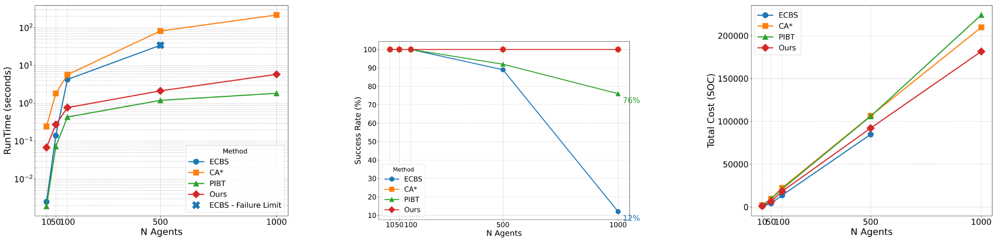
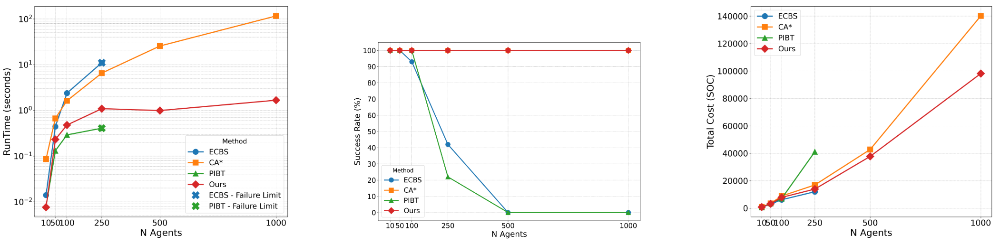
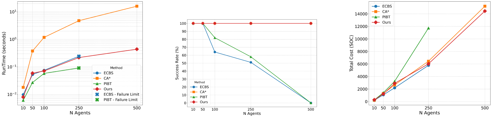

# Hybrid Prioritized MAPF: Geometric Conflict Preemption

This repository contains the implementation of a **Hybrid Prioritized Multi-Agent Path Finding (MAPF)** framework. Our approach shifts the paradigm of collision avoidance from continuous temporal synchronization to **preemptive geometric planning**, enabling high scalability for coordination in large-scale **Discrete Event Systems (DES)**.

---

## Overview

The **Multi-Agent Path Finding (MAPF)** problem—computing collision-free trajectories for multiple agents in a shared environment—is fundamental in robotics, warehouse automation, and logistics. While *prioritized solvers* offer strong scalability, they traditionally rely on extensive temporal modeling (space–time graphs) and constant synchronization via wait actions. This often leads to performance bottlenecks in dense or large environments.

This framework introduces a **hybrid architecture** that minimizes temporal dependencies. By using **dynamic geometric cost inflation**, the system encourages agents to take spatial detours that resolve potential conflicts *before* they occur in time.

---

## Key Contributions

- **Preemptive Geometric Planning**  
  Higher-priority trajectories dynamically inflate traversal costs for subsequent agents, forcing spatial detours instead of temporal waits.

- **Minimalist Synchronization**  
  Temporal reasoning is only introduced when strictly necessary to resolve residual spatiotemporal conflicts, reducing the overhead of continuous coordination.

- **Extreme Scalability**  
  Reliable computation of collision-free trajectories for **1,000+ agents in under 10 seconds**.

- **Competitive Performance**  
  Achieves strong Sum of Costs (SOC) and runtimes approaching bounded-suboptimal centralized solvers by emphasizing geometric conflict avoidance.

---

## Getting Started

### Installation

```bash
git clone https://github.com/FerSalAnova/Prioritized-Multi-Agent-Path-Finding-Framework-with-Dynamic-Local-Control-for-Spatially-Safer-Paths.git
cd Prioritized-Multi-Agent-Path-Finding-Framework-with-Dynamic-Local-Control-for-Spatially-Safer-Paths
```

Open main in Matlab and select Priority policy, map and number of agents.
Execute in Matlab.

## Results

We compareed our results in multiple scenarios to different SOTA methods (CA* / PIBT / ECBS):

### Large-Scale Coordination (Paris Map)

Navigating a 256×256 open environment.  
The geometric cost inflation mechanism successfully resolves conflicts spatially with minimal waiting.



---

### Bottleneck Resolution (Room Map)

In constrained environments with heavy bottlenecks, agents proactively detour around future conflicts instead of relying on temporal waits.



---

### Dense Random Environment

Performance in a 32×32 grid with 20% random obstacles, highlighting robustness under erratic geometries.



---

### Video Demonstration

**Full simulation video (100 agents):**  
[Click here to watch the video](assets/Paris_video.webm)


